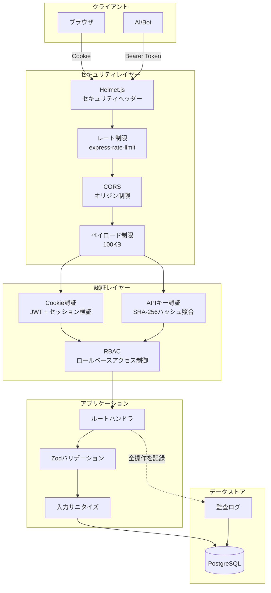
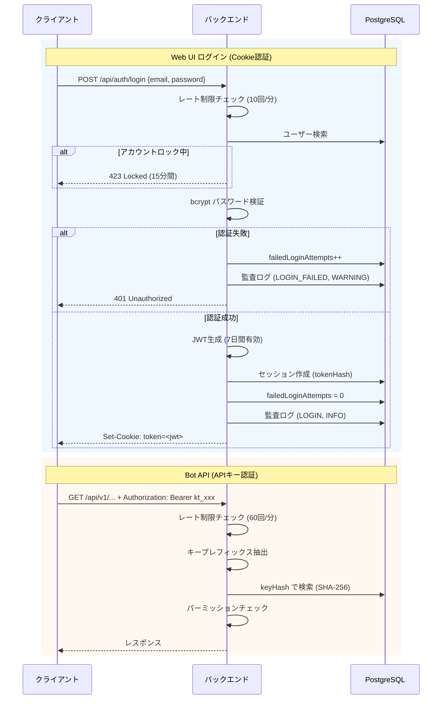
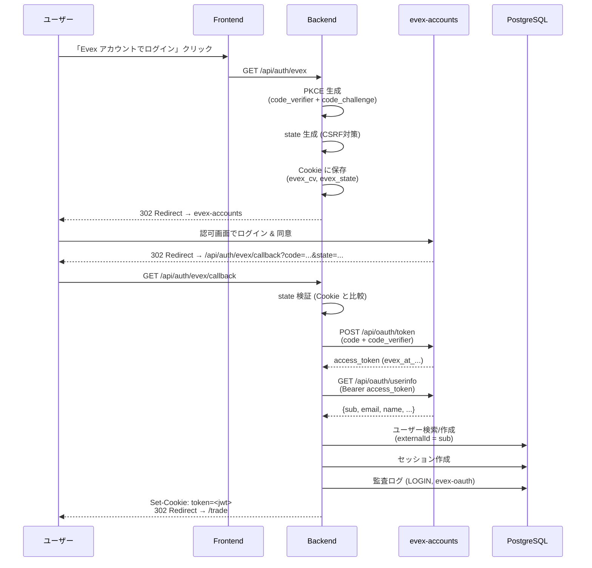
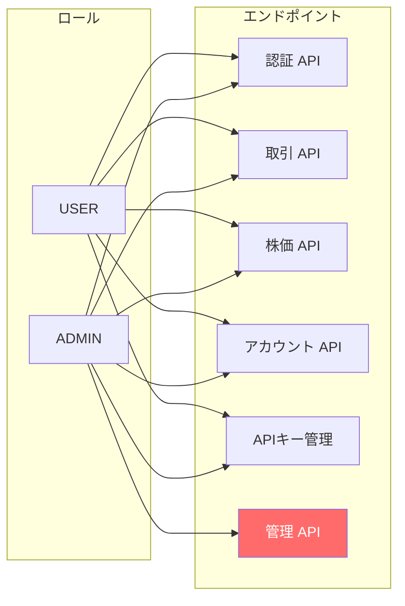
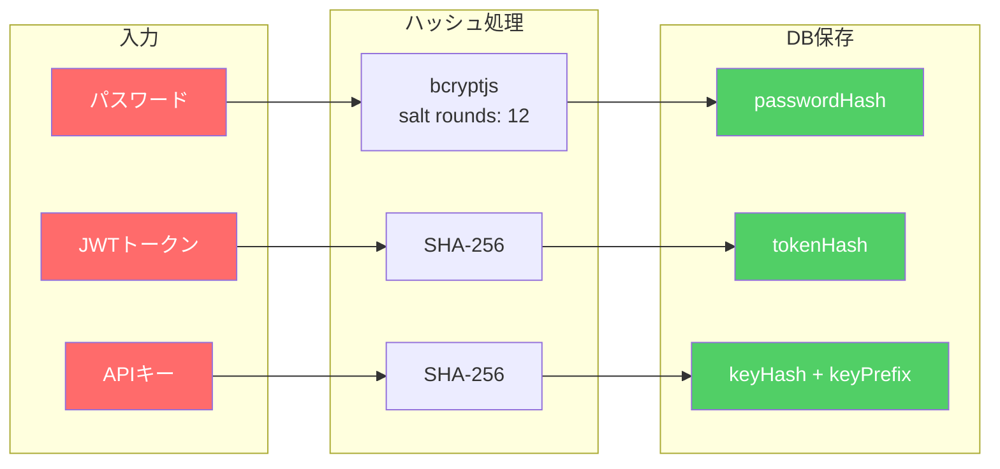
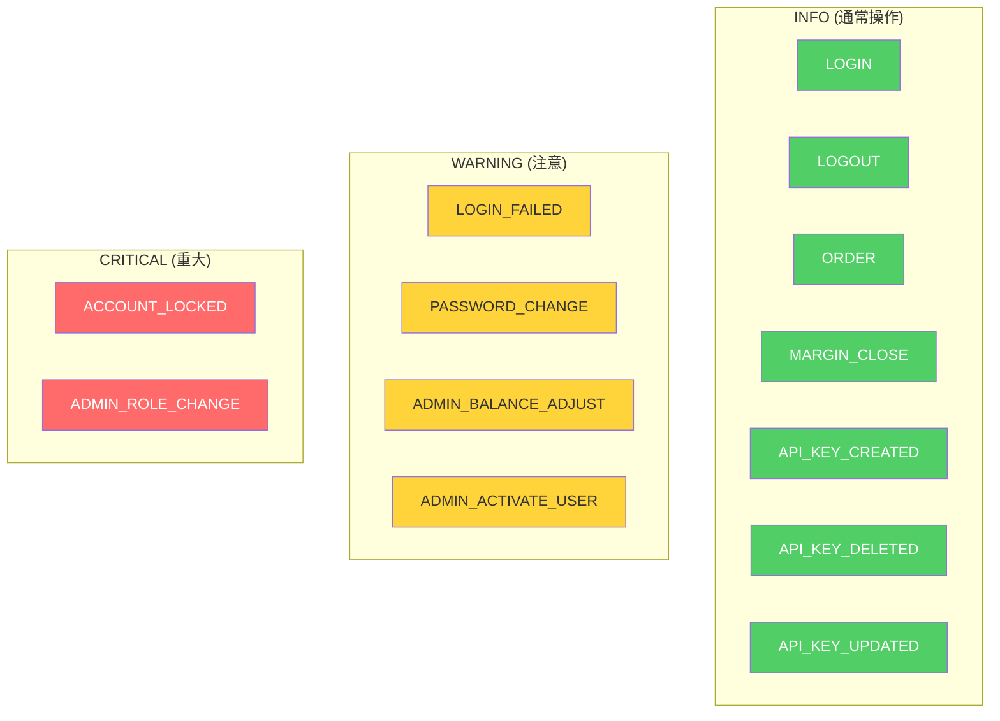
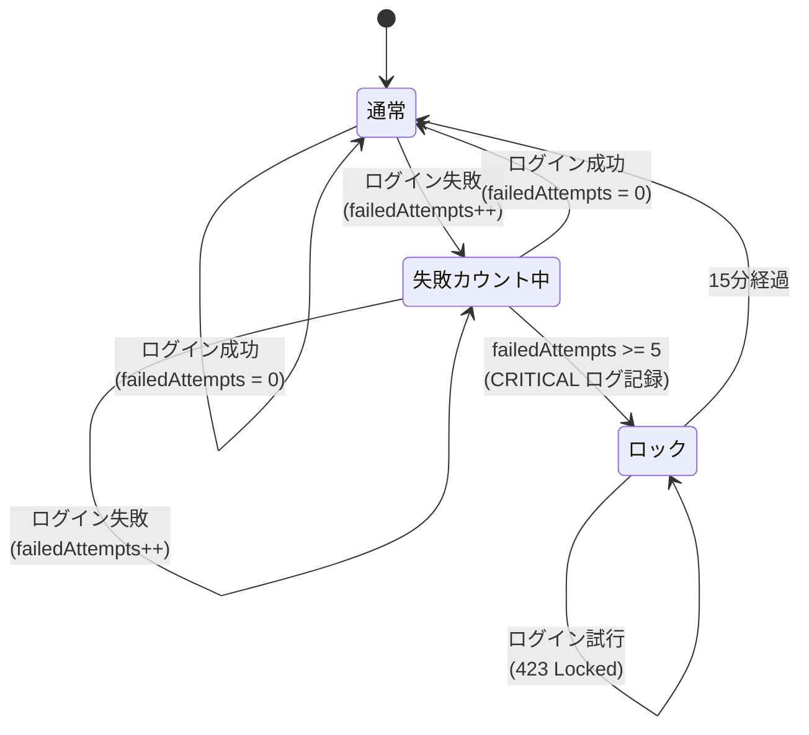

# KabuTrade セキュリティドキュメント

KabuTrade のセキュリティアーキテクチャと実装の詳細。

---

## 目次

- [セキュリティアーキテクチャ概要](#セキュリティアーキテクチャ概要)
- [認証・認可](#認証認可)
- [データ保護](#データ保護)
- [ネットワークセキュリティ](#ネットワークセキュリティ)
- [監査ログ](#監査ログ)
- [アカウント保護](#アカウント保護)
- [入力バリデーション](#入力バリデーション)
- [セキュリティヘッダー](#セキュリティヘッダー)

---

## セキュリティアーキテクチャ概要

---

## 認証・認可

### 認証フロー

### evex-accounts OAuth 2.0 フロー

evex-accounts が設定されている場合、OAuth 2.0 Authorization Code + PKCE (S256) フローによるログインが利用可能です。

#### evex-accounts 設定

| 環境変数 | 説明 |
|---|---|
| `EVEX_ACCOUNTS_URL` | evex-accounts サーバーURL (例: `https://accounts.evex.land`) |
| `EVEX_CLIENT_ID` | OAuth Client ID |
| `EVEX_CLIENT_SECRET` | OAuth Client Secret |
| `EVEX_REDIRECT_URI` | コールバックURL (例: `http://localhost:4000/api/auth/evex/callback`) |

#### スコープ

| スコープ | 用途 |
|---|---|
| `openid` | ユーザーID (sub) の取得 |
| `profile` | ユーザー名・アイコンの取得 |
| `email` | メールアドレスの取得 |

#### トークン仕様

| 項目 | 値 |
|---|---|
| トークン形式 | Opaque (JWT ではない) |
| プレフィックス | `evex_at_` (access) / `evex_rt_` (refresh) |
| Access Token TTL | 1時間 |
| Refresh Token TTL | 30日 (ローテーション) |
| 保存方式 | サーバー側で SHA-256 ハッシュのみ保存 |

#### セキュリティ対策

| 対策 | 実装 |
|---|---|
| CSRF | `state` パラメータを HttpOnly Cookie に保存し、コールバック時に検証 |
| PKCE (S256) | `code_verifier` を Cookie に保存、認可サーバーが `code_challenge` を検証 |
| Cookie セキュリティ | HttpOnly / Secure (本番) / SameSite=Lax / 5分間有効 |
| クライアント認証 | `client_secret_post` (トークンリクエストのボディに含めて送信) |

#### ユーザーマッピング

OAuth ログイン時のローカルユーザー紐付けロジック:

1. `externalId` (= evex-accounts の `sub`) でユーザーを検索
2. 見つからない場合、`email` で既存ユーザーを検索 → `externalId` を紐付け
3. どちらも見つからない場合、新規ユーザーを自動作成 (初期残高付与)
4. 既存ユーザーの名前・メールが変更されていれば自動更新

### 認証方式の比較

| 方式 | 用途 | トークン保存 | 有効期限 | 失効方法 |
|---|---|---|---|---|
| Cookie (JWT) | Web UI (ローカル認証) | サーバー側: tokenHash (SHA-256) | 7日間 | ログアウト / セッション失効 |
| evex-accounts OAuth | Web UI (外部認証) | evex: opaque token / KabuTrade: JWT Cookie | evex: 1h (AT) / KabuTrade: 7日 | ログアウト |
| APIキー | Bot/AI | サーバー側: keyHash (SHA-256) | 任意 (無期限可) | 削除 / 無効化 |

### ロールベースアクセス制御 (RBAC)

### APIキーパーミッション

| パーミッション | アクセス可能な操作 |
|---|---|
| `read` | 株価取得、残高確認、注文履歴、ポジション一覧 |
| `trade` | 現物注文の発注 |
| `margin` | 信用取引 (買建・売建・決済) |
| `*` | 全権限 |

---

## データ保護

### 機密データの保存方式

| データ | ハッシュ方式 | 備考 |
|---|---|---|
| パスワード | bcrypt (12 rounds) | 不可逆。照合のみ可能 |
| JWTトークン | SHA-256 | 平文はDBに保存しない |
| APIキー | SHA-256 | 作成時に一度だけ表示。keyPrefix (先頭4文字) を別途保存しレート制限に使用 |

### APIキーのライフサイクル

1. **作成** — ランダム生成 → SHA-256ハッシュをDBに保存 → 平文キーをレスポンスで返却 (一度のみ)
2. **認証** — リクエストのキーをSHA-256 → DB上のhashと照合
3. **無効化** — `isActive: false` に更新、または削除
4. 制約: ユーザーあたり最大10個

---

## ネットワークセキュリティ

### レート制限

| エンドポイント | 制限 | 単位 | 目的 |
|---|---|---|---|
| 一般 API | 100 req/min | IP | DoS防止 |
| 認証 (`/api/auth/*`) | 10 req/min | IP | ブルートフォース防止 |
| 取引 (`/api/trade/*`) | 30 req/min | IP | 過剰注文防止 |
| Bot API (`/api/v1/*`) | 60 req/min | APIキーprefix | Bot用レート制御 |
| APIキー作成 | 5 req/hour | IP | 乱用防止 |

### ペイロード制限

- リクエストボディ上限: **100KB**
- 超過時は `413 Payload Too Large` を返却

---

## 監査ログ

全てのセキュリティイベントおよび重要な操作は `audit_logs` テーブルに永続記録されます。

> **監査ログは削除されません。** コンプライアンスおよびセキュリティ調査のため、全ログを永続保持します。

### 記録される操作

### ログスキーマ

| フィールド | 型 | 説明 |
|---|---|---|
| `id` | String | CUID |
| `userId` | String? | 操作者のユーザーID |
| `action` | String | 操作種別 (上図参照) |
| `resource` | String? | 対象リソース (`order:xxx`, `user:xxx` など) |
| `detail` | String? | 詳細情報 (JSON) |
| `ipAddress` | String? | リクエスト元IP |
| `userAgent` | String? | User-Agent |
| `severity` | String | `INFO` / `WARNING` / `CRITICAL` |
| `createdAt` | DateTime | タイムスタンプ |

### 管理画面からの閲覧

管理者は `GET /api/admin/audit-logs` で監査ログを閲覧できます。フィルター:

- `severity` — 重大度でフィルタ
- `action` — 操作種別でフィルタ
- `userId` — ユーザーでフィルタ
- `page` — ページネーション

---

## アカウント保護

### ブルートフォース対策

- **ロック閾値:** 5回連続失敗
- **ロック時間:** 15分間
- **ロック時の記録:** `ACCOUNT_LOCKED` (severity: CRITICAL)

### パスワードポリシー

| ルール | 要件 |
|---|---|
| 最小文字数 | 12文字 |
| 最大文字数 | 128文字 |
| 大文字 | 1文字以上 |
| 小文字 | 1文字以上 |
| 数字 | 1文字以上 |
| 特殊文字 | 1文字以上 |
| 禁止パスワード | `password`, `12345678`, `qwerty` 等の一般的なパスワードはブロック |

---

## 入力バリデーション

### Zodスキーマによる検証

全APIエンドポイントで [Zod](https://zod.dev/) による入力バリデーションを実施。

| スキーマ | 対象 | 主な制約 |
|---|---|---|
| `loginSchema` | ログイン | email形式、password必須 |
| `registerSchema` | ユーザー登録 | email形式、name、passwordポリシー適用 |
| `orderSchema` | 注文発注 | symbol必須、market (JP/US)、side (BUY/SELL)、type、quantity (正の整数)、LIMIT時はprice必須 |
| `apiKeyCreateSchema` | APIキー作成 | name必須、permissions配列、expiresInDays |
| `marginCloseSchema` | 信用決済 | positionId必須 |
| `adminUserUpdateSchema` | 管理者によるユーザー編集 | 部分更新可、各フィールドの型制約 |

### HTMLサニタイズ

ユーザー入力はHTMLエンティティエンコーディングでサニタイズし、XSSを防止。

---

## セキュリティヘッダー

[Helmet.js](https://helmetjs.github.io/) により以下のヘッダーを自動設定:

| ヘッダー | 効果 |
|---|---|
| `Content-Security-Policy` | XSS / コードインジェクション防止 |
| `Strict-Transport-Security` | HTTPS強制 (HSTS) |
| `X-Frame-Options` | クリックジャッキング防止 |
| `X-Content-Type-Options` | MIMEタイプスニッフィング防止 |
| `X-XSS-Protection` | ブラウザXSSフィルター有効化 |
| `Referrer-Policy` | リファラー情報の漏洩防止 |

---

## セッション管理

| 項目 | 値 |
|---|---|
| セッション保存 | PostgreSQL (`sessions` テーブル) |
| トークン保存 | SHA-256ハッシュのみ (平文なし) |
| セッション有効期限 | 7日間 |
| 期限切れセッション清掃 | 1時間ごと自動実行 |
| 全セッション無効化 | `POST /api/auth/revoke-all-sessions` |
| 追跡情報 | IPアドレス、User-Agent |
